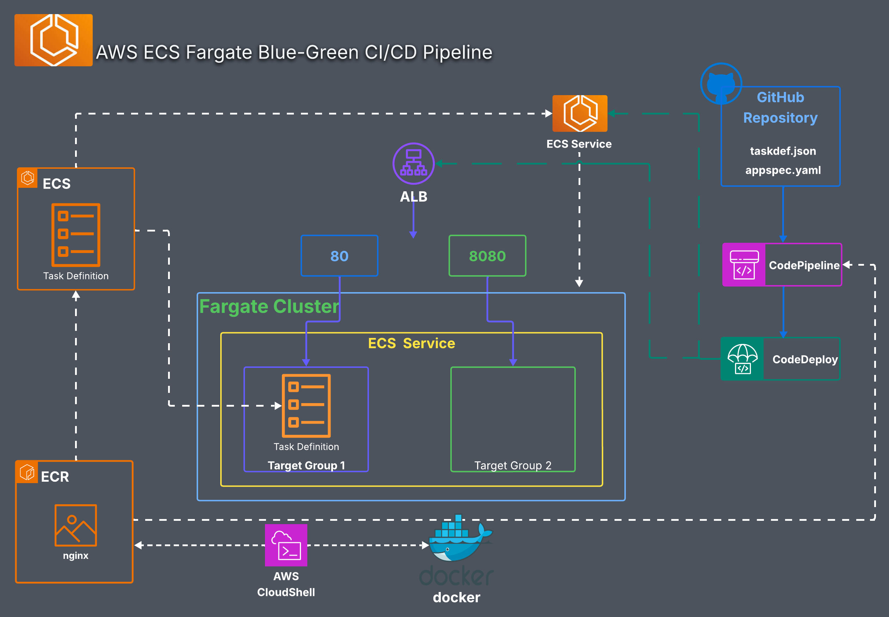

# AWS ECS Fargate Blue-Green CI/CD Pipeline

## 🎓 Project Origin

This project was completed as part of my hands-on training in the **Digital Cloud Training Cloud Mastery Bootcamp**. The objective was to move away from manual AWS console deployments and build a production-grade, fully automated CI/CD pipeline using infrastructure best practices.

This repository contains the configuration and source code for a automated CI/CD pipeline deploying an `nginx` application to AWS ECS Fargate using an Application Load Balancer (ALB).

## 🚀 Architecture Overview

This project implements a Blue/Green deployment strategy using the following AWS and DevOps tools:
* **GitHub**: Source code repository holding application code, `taskdef.json`, and `appspec.yaml`.
* **AWS CodePipeline**: Orchestrates the workflow from code commit to deployment.
* **AWS CodeDeploy**: Manages the Blue/Green deployment between Target Groups.
* **Amazon ECR**: Stores the Docker container images (`nginx`).
* **Amazon ECS (Fargate)**: Runs the application containers serverlessly.
* **Application Load Balancer (ALB)**: Routes traffic to active tasks via ports `80` and `8080`.

## 🚀 Architecture Diagram

## 📂 Repository Structure

* `taskdef.json` — Defines the ECS Task Definition (container image, CPU/Memory, port mappings).
* `appspec.yaml` — Instructs AWS CodeDeploy on how to route traffic during deployment.

## 🛠️ Prerequisites & Setup

Before running this pipeline, ensure you have:
1. An AWS Account with configured IAM permissions for ECS, CodeDeploy, and CodePipeline.
2. The AWS CLI or AWS CloudShell installed/configured.
3. An ECS Fargate cluster created with an ALB and two Target Groups (Target Group 1 and Target Group 2).

## Deployment Steps

1. **Configure Task Definition:** Update the `taskdef.json` file with your specific execution role ARNs and ECR repository URI.
2. **Push to GitHub:** Commit your changes and push them to the `main` branch.
3. **Trigger Pipeline:** AWS CodePipeline will automatically detect the changes, pull the code, and trigger CodeDeploy to safely transition traffic to your new tasks.

---

